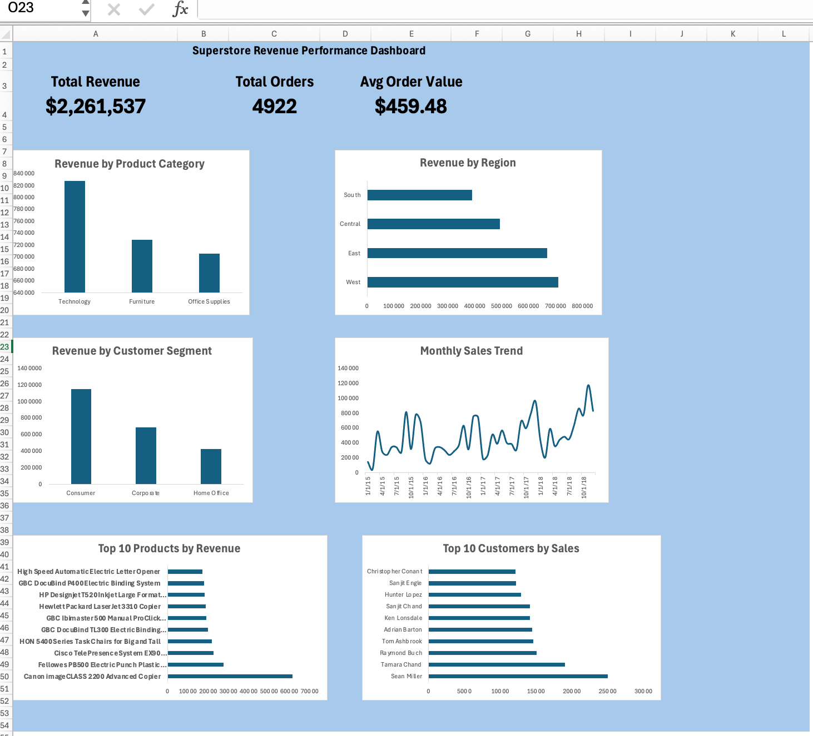

# Superstore Sales Analysis

This project analyzes retail sales data using **SQL and Excel** to uncover key business insights and build a KPI dashboard.

## Project Overview

The goal of this project was to analyze Superstore sales performance and build a dashboard to track important business metrics such as revenue, order volume, and customer behavior.

## Tools Used

- SQL (data analysis and queries)
- Excel (dashboard and visualization)
- GitHub (project version control)

## Key Metrics

The dashboard highlights:

- Total Sales
- Total Orders
- Average Order Value
- Revenue by Product Category
- Revenue by Region
- Revenue by Customer Segment
- Monthly Sales Trend
- Top 10 Products by Revenue
- Top 10 Customers by Sales

## Dashboard Preview

## Project Structure
